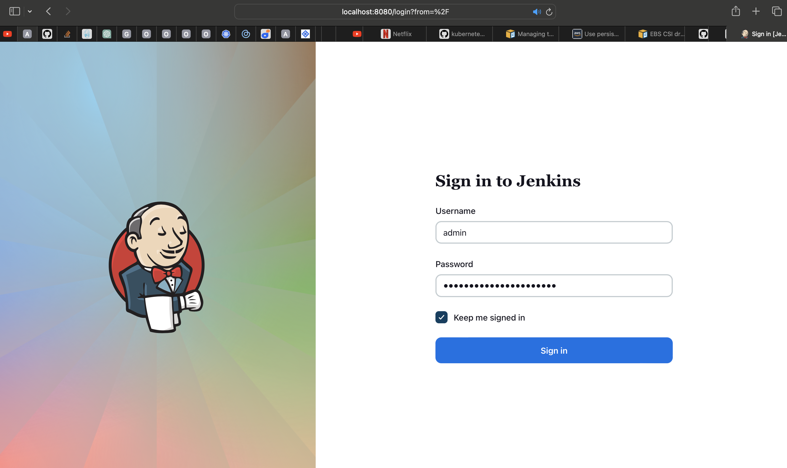

# Building Elastic Kubernetes Service (EKS) With Terraform - Deploying and Packaging applications with Helm

In this project,

1. We will use Terraform to create a Kubernetes EKS cluster and dynamically add scalable worker nodes
2. We will deploy applications using HELM
3. We will experience more kubernetes objects and how to use them with Helm.

## Building EKS with Terraform

**Note:** Use Terraform version `v1.0.2`

1. Open up a new directory on your laptop, and name it `eks`
2. Use AWS CLI to create an S3 bucket
3. Create a file - `backend.tf`

`aws s3api create-bucket --bucket riastouch-bucket --region eu-central-1`

or

```
resource "aws_s3_bucket" "pbl-s3" {
  bucket = "pbl-mayor-eks-cluster-bucket"

 tags = merge(
    var.tags,
    {
      Name = "${var.cluster-name}-pbl-ngw-eip"
    },
  )
}

resource "aws_s3_bucket_acl" "pbl-acl" {
  bucket = aws_s3_bucket.pbl-s3.id
  acl    = "private"
}

resource "aws_s3_bucket_versioning" "pbl-s3-versioning" {
  bucket = aws_s3_bucket.pbl-s3.id
  versioning_configuration {
    status = "Enabled"
  }
}
```

4. Create a file - `network.tf` and provision Elastic IP for Nat Gateway, VPC, Private and public subnets.

```
# reserve Elastic IP to be used in our NAT gateway
resource "aws_eip" "nat_gw_elastic_ip" {
  vpc = true

  tags = {
    Name            = "${var.cluster_name}-nat-eip"
    iac_environment = var.iac_environment_tag
  }
}

# create VPC using the official AWS module
module "vpc" {
  source  = "terraform-aws-modules/vpc/aws"

  name = "${var.name_prefix}-vpc"
  cidr = var.main_network_block
  azs  = data.aws_availability_zones.available_azs.names

  private_subnets = [
    # this loop will create a one-line list as ["10.0.0.0/20", "10.0.16.0/20", "10.0.32.0/20", ...]
    # with a length depending on how many Zones are available
    for zone_id in data.aws_availability_zones.available_azs.zone_ids :
    cidrsubnet(var.main_network_block, var.subnet_prefix_extension, tonumber(substr(zone_id, length(zone_id) - 1, 1)) - 1)
  ]

  public_subnets = [
    # this loop will create a one-line list as ["10.0.128.0/20", "10.0.144.0/20", "10.0.160.0/20", ...]
    # with a length depending on how many Zones are available
    # there is a zone Offset variable, to make sure no collisions are present with private subnet blocks
    for zone_id in data.aws_availability_zones.available_azs.zone_ids :
    cidrsubnet(var.main_network_block, var.subnet_prefix_extension, tonumber(substr(zone_id, length(zone_id) - 1, 1)) + var.zone_offset - 1)
  ]

  # enable single NAT Gateway to save some money
  # WARNING: this could create a single point of failure, since we are creating a NAT Gateway in one AZ only
  # feel free to change these options if you need to ensure full Availability without the need of running 'terraform apply'
  # reference: https://registry.terraform.io/modules/terraform-aws-modules/vpc/aws/2.44.0#nat-gateway-scenarios
  enable_nat_gateway     = true
  single_nat_gateway     = true
  one_nat_gateway_per_az = false
  enable_dns_hostnames   = true
  reuse_nat_ips          = true
  external_nat_ip_ids    = [aws_eip.nat_gw_elastic_ip.id]

  # add VPC/Subnet tags required by EKS
  tags = {
    "kubernetes.io/cluster/${var.cluster_name}" = "shared"
    iac_environment                             = var.iac_environment_tag
  }
  public_subnet_tags = {
    "kubernetes.io/cluster/${var.cluster_name}" = "shared"
    "kubernetes.io/role/elb"                    = "1"
    iac_environment                             = var.iac_environment_tag
  }
  private_subnet_tags = {
    "kubernetes.io/cluster/${var.cluster_name}" = "shared"
    "kubernetes.io/role/internal-elb"           = "1"
    iac_environment                             = var.iac_environment_tag
  }
}
```

**Note:** The tags added to the subnets is very important. The Kubernetes Cloud Controller Manager (cloud-controller-manager) and AWS Load Balancer Controller (aws-load-balancer-controller) needs to identify the cluster's. To do that, it querries the cluster's subnets by using the tags as a filter.

- For public and private subnets that use load balancer resources: each subnet must be tagged

```
Key: kubernetes.io/cluster/cluster-name
Value: shared
```

- For private subnets that use internal load balancer resources: each subnet must be tagged

```
Key: kubernetes.io/role/internal-elb
Value: 1
```

- For public subnets that use internal load balancer resources: each subnet must be tagged

```
Key: kubernetes.io/role/elb
Value: 1
```


5. Create a file - `variables.tf`

```
# create some variables
variable "cluster_name" {
  type        = string
  description = "EKS cluster name."
}
variable "iac_environment_tag" {
  type        = string
  description = "AWS tag to indicate environment name of each infrastructure object."
}
variable "name_prefix" {
  type        = string
  description = "Prefix to be used on each infrastructure object Name created in AWS."
}
variable "main_network_block" {
  type        = string
  description = "Base CIDR block to be used in our VPC."
}
variable "subnet_prefix_extension" {
  type        = number
  description = "CIDR block bits extension to calculate CIDR blocks of each subnetwork."
}
variable "zone_offset" {
  type        = number
  description = "CIDR block bits extension offset to calculate Public subnets, avoiding collisions with Private subnets."
}
```

6. Create a file - `data.tf` - This will pull the available AZs for use.

```
# get all available AZs in our region
data "aws_availability_zones" "available_azs" {
  state = "available"
}

data "aws_caller_identity" "current" {} # used for accesing Account ID and ARN
```

7. Create a file - `eks.tf` and provision EKS cluster [Read more about this module from the official documentation here](https://registry.terraform.io/modules/terraform-aws-modules/eks/aws/17.1.0) - Reading it will help you understand more about the rich features of the module.

```
module "eks-cluster" {
  source           = "terraform-aws-modules/eks/aws"
  version          = "17.1.0"
  cluster_name     = "${var.cluster_name}"
  cluster_version  = "1.20"
  write_kubeconfig = true

  subnets = module.vpc.private_subnets
  vpc_id  = module.vpc.vpc_id

 worker_groups_launch_template = local.worker_groups_launch_template

  # map developer & admin ARNs as kubernetes Users
  map_users = concat(local.admin_user_map_users, local.developer_user_map_users)
}

```

8. Create a file - `worker-nodes.tf` - This is used to set the policies for autoscaling. To save as much as 90% of cost we will use Spot Instances - [Read more here](https://aws.amazon.com/blogs/containers/cost-optimization-for-kubernetes-on-aws/) 

```
# add spot fleet Autoscaling policy
resource "aws_autoscaling_policy" "eks_autoscaling_policy" {
  count = length(local.worker_groups_launch_template)

  name                   = "${module.eks-cluster.workers_asg_names[count.index]}-autoscaling-policy"
  autoscaling_group_name = module.eks-cluster.workers_asg_names[count.index]
  policy_type            = "TargetTrackingScaling"

  target_tracking_configuration {
    predefined_metric_specification {
      predefined_metric_type = "ASGAverageCPUUtilization"
    }
    target_value = var.autoscaling_average_cpu
  }
}
```

9. Create a file - `locals.tf` to create local variables. Terraform does not allow assigning variable to variables. There is good reasons for that to avoid repeating your code unecessarily. So a terraform way to achieve this would be to use locals so that your code can be kept [DRY](https://en.wikipedia.org/wiki/Don%27t_repeat_yourself)

```
# render Admin & Developer users list with the structure required by EKS module
locals {
  admin_user_map_users = [
    for admin_user in var.admin_users :
    {
      userarn  = "arn:aws:iam::${data.aws_caller_identity.current.account_id}:user/${admin_user}"
      username = admin_user
      groups   = ["system:masters"]
    }
  ]
  developer_user_map_users = [
    for developer_user in var.developer_users :
    {
      userarn  = "arn:aws:iam::${data.aws_caller_identity.current.account_id}:user/${developer_user}"
      username = developer_user
      groups   = ["${var.name_prefix}-developers"]
    }
  ]
  worker_groups_launch_template = [
    {
      override_instance_types = var.asg_instance_types
      asg_desired_capacity    = var.autoscaling_minimum_size_by_az * length(data.aws_availability_zones.available_azs.zone_ids)
      asg_min_size            = var.autoscaling_minimum_size_by_az * length(data.aws_availability_zones.available_azs.zone_ids)
      asg_max_size            = var.autoscaling_maximum_size_by_az * length(data.aws_availability_zones.available_azs.zone_ids)
      kubelet_extra_args      = "--node-labels=node.kubernetes.io/lifecycle=spot" # Using Spot instances means we can save a lot of money and scale to have even more instances.
      public_ip               = true
    },
  ]
}
```

10. Add more variables to the `variables.tf` file

```
# create some variables
variable "admin_users" {
  type        = list(string)
  description = "List of Kubernetes admins."
}
variable "developer_users" {
  type        = list(string)
  description = "List of Kubernetes developers."
}
variable "asg_instance_types" {
  type        = list(string)
  description = "List of EC2 instance machine types to be used in EKS."
}
variable "autoscaling_minimum_size_by_az" {
  type        = number
  description = "Minimum number of EC2 instances to autoscale our EKS cluster on each AZ."
}
variable "autoscaling_maximum_size_by_az" {
  type        = number
  description = "Maximum number of EC2 instances to autoscale our EKS cluster on each AZ."
}
variable "autoscaling_average_cpu" {
  type        = number
  description = "Average CPU threshold to autoscale EKS EC2 instances."
}
```

11. Create a file - `variables.tfvars` to set values for variables.

```
cluster_name            = "tooling-app-eks"
iac_environment_tag     = "development"
name_prefix             = "darey-io-eks"
main_network_block      = "10.0.0.0/16"
subnet_prefix_extension = 4
zone_offset             = 8

# Ensure that these users already exist in AWS IAM. Another approach is that you can introduce an iam.tf file to manage users separately, get the data source and interpolate their ARN.
admin_users                              = ["dare", "solomon"]
developer_users                          = ["leke", "david"]
asg_instance_types                       = ["t3.small", "t2.small"]
autoscaling_minimum_size_by_az           = 1
autoscaling_maximum_size_by_az           = 10
autoscaling_average_cpu                  = 30
```

12. Create file - `provider.tf`

```
provider "aws" {
  region = "us-west-1"
}

provider "random" {
}

```

13. Run `terraform init`

14. Run Terraform plan - Your plan should have an output

```
Plan: 41 to add, 0 to change, 0 to destroy.

```
15. Run Terraform apply

This will begin to create cloud resources, and fail at some point with the error

```
╷
│ Error: Post "http://localhost/api/v1/namespaces/kube-system/configmaps": dial tcp [::1]:80: connect: connection refused
│ 
│   with module.eks-cluster.kubernetes_config_map.aws_auth[0],
│   on .terraform/modules/eks-cluster/aws_auth.tf line 63, in resource "kubernetes_config_map" "aws_auth":
│   63: resource "kubernetes_config_map" "aws_auth" {
```

That is because for us to connect to the cluster using the kubeconfig, Terraform needs to be able to connect and set the credentials correctly.

To fix this problem

- Append to the file `data.tf`

```
# get EKS cluster info to configure Kubernetes and Helm providers
data "aws_eks_cluster" "cluster" {
  name = module.eks-cluster.cluster_id
}
data "aws_eks_cluster_auth" "cluster" {
  name = module.eks-cluster.cluster_id
}
```

- Append to the file `provider.tf`

```
# get EKS authentication for being able to manage k8s objects from terraform
provider "kubernetes" {
  host                   = data.aws_eks_cluster.cluster.endpoint
  cluster_ca_certificate = base64decode(data.aws_eks_cluster.cluster.certificate_authority.0.data)
  token                  = data.aws_eks_cluster_auth.cluster.token
}
```

- Run the init and plan again - This time you will see

```
  # module.eks-cluster.kubernetes_config_map.aws_auth[0] will be created
  + resource "kubernetes_config_map" "aws_auth" {
      + data = {
          + "mapAccounts" = jsonencode([])
          + "mapRoles"    = <<-EOT
                - "groups":
                  - "system:bootstrappers"
                  - "system:nodes"
                  "rolearn": "arn:aws:iam::696742900004:role/tooling-app-eks20210718113602300300000009"
                  "username": "system:node:{{EC2PrivateDNSName}}"
            EOT
          + "mapUsers"    = <<-EOT
                - "groups":
                  - "system:masters"
                  "userarn": "arn:aws:iam::696742900004:user/dare"
                  "username": "dare"
                - "groups":
                  - "system:masters"
                  "userarn": "arn:aws:iam::696742900004:user/solomon"
                  "username": "solomon"
                - "groups":
                  - "darey-io-eks-developers"
                  "userarn": "arn:aws:iam::696742900004:user/leke"
                  "username": "leke"
                - "groups":
                  - "darey-io-eks-developers"
                  "userarn": "arn:aws:iam::696742900004:user/david"
                  "username": "david"
            EOT
        }
      + id   = (known after apply)

      + metadata {
          + generation       = (known after apply)
          + labels           = {
              + "app.kubernetes.io/managed-by" = "Terraform"
              + "terraform.io/module"          = "terraform-aws-modules.eks.aws"
            }
          + name             = "aws-auth"
          + namespace        = "kube-system"
          + resource_version = (known after apply)
          + uid              = (known after apply)
        }
    }

Plan: 1 to add, 0 to change, 0 to destroy.
```

## Deploy applications with Helm

A Helm chart is a definition of the resources that are required to run an application in Kubernetes. Instead of having to think about all of the various deployments/services/volumes/configmaps/ etc that make up your application, you can use a command like

```
helm install stable/mysql
```

and Helm will make sure all the required resources are installed. In addition you will be able to tweak helm configuration by setting a single variable to a particular value and more or less resources will be deployed. For example, enabling slave for MySQL so that it can have read only replicas.

Behind the scenes, a helm chart is essentially a bunch of YAML manifests that define all the resources required by the application. Helm takes care of creating the resources in Kubernetes (where they don't exist) and removing old resources.

### Lets begin to gradually walk through how to use Helm (Credit - https://andrewlock.net/series/deploying-asp-net-core-applications-to-kubernetes/) @igor please update the texts as much as possible to reduce plagiarism

1. Parameterising YAML manifests using Helm templates

Let's consider we have a Tooling app that have been Dockerised into an image called `tooling-app`, and that you wish to deploy with Kubernetes. Without helm, you would create the YAML manifests defining the deployment, service, and ingress, and apply them to your Kubernetes cluster using `kubectl apply`. Initially, your application is version 1, and so the Docker image is tagged as `tooling-app:1.0.0`. A simple deployment manifest might look something like the following:

```
apiVersion: apps/v1
kind: Deployment
metadata:
  name: tooling-app-deployment
  labels:
    app: tooling-app
spec:
  replicas: 3
  strategy: 
    type: RollingUpdate
    rollingUpdate:
      maxUnavailable: 1
  selector:
    matchLabels:
      app: tooling-app
  template:
    metadata:
      labels:
        app: tooling-app
    spec:
      containers:
      - name: tooling-app
        image: "tooling-app:1.0.0"
        ports:
        - containerPort: 80
```

Now lets imagine that the developers develops another version of the tooling app, version 1.1.0. How do you deploy that? Assuming nothing needs to be changed with the service or other kubernetes objects, it may be as simple as copying the deployment manifest and replacing the image defined in the spec section. You would then re-apply this manifest to the cluster, and the deployment would be updated, performing a [rolling-update](https://kubernetes.io/docs/tutorials/kubernetes-basics/update/update-intro/).

The main problem with this is that all of the values specific to the tooling app – the labels and the image names etc – are mixed up with the entire definition of the manifest.

Helm tackles this by splitting the configuration of a chart out from its basic definition. For example, instead of hard coding the name of your app or the specific container image into the manifest, you can provide those when you install the "chart" (More on this later) into the cluster.

For example, a simple templated version of the tooling app deployment might look like the following:

```
apiVersion: apps/v1
kind: Deployment
metadata:
  name: {{ .Release.Name }}-deployment
  labels:
    app: "{{ template "name" . }}"
spec:
  replicas: 3
  strategy: 
    type: RollingUpdate
    rollingUpdate:
      maxUnavailable: 1
  selector:
    matchLabels:
      app: "{{ template "name" . }}"
  template:
    metadata:
      labels:
        app: "{{ template "name" . }}"
    spec:
      containers:
      - name: "{{ template "name" . }}"
        image: "{{ .Values.image.name }}:{{ .Values.image.tag }}"
        ports:
        - containerPort: 80
```

This example demonstrates a number of features of Helm templates:

The template is based on YAML, with {{ }} mustache syntax defining dynamic sections.
Helm provides various variables that are populated at install time. For example, the {{.Release.Name}} allows you to change the name of the resource at runtime by using the release name. Installing a Helm chart creates a release (this is a Helm concept rather than a Kubernetes concept).
You can define helper methods in external files. The {{template "name"}} call gets a safe name for the app, given the name of the Helm chart (but which can be overridden). By using helper functions, you can reduce the duplication of static values (like tooling-app), and hopefully reduce the risk of typos.

You can manually provide configuration at runtime. The {{.Values.image.name}} value for example is taken from a set of default values, or from values provided when you call helm install. There are many different ways to provide the configuration values needed to install a chart using Helm. Typically, you would use two approaches:

A values.yaml file that is part of the chart itself. This typically provides default values for the configuration, as well as serving as documentation for the various configuration values.

When providing configuration on the command line, you can either supply a file of configuration values using the `-f` flag. We will see a lot more on this later on.

**Now lets setup Helm and begin to use it.**

According to the official documentation [here](https://helm.sh/docs/intro/install/), there are different options to installing Helm. 

Check that Helm is installed

`helm version`


### Deploy Jenkins with Helm

Note: To switch between clusters using kubectl, you can use the kubectl config use-context command

- List Available Contexts:

`kubectl config get-contexts`

- Switch to a Different Context:

`kubectl config use-context <context-name>`

- Verify the Switch:

`kubectl config current-context`

Before we begin to deploy application into our Kubernetes cluster
Another thing to note is Amazon Web Services (AWS) offers a powerful solution, the Elastic Block Store (EBS) CSI (Container Storage Interface) driver, for managing persistent storage in Kubernetes clusters.
With the EBS CSI driver, Kubernetes clusters can automatically provision EBS volumes based on storage requirements specified in PersistentVolumeClaims (PVCs) in our applications or helm chart. Follow instructions on this github repo to [configure EBS CSI Driver](https://github.com/MayorFaj/AWS-EBS-CSI-Driver.git). 

Let's begin;

1. Visit [Artifact Hub](https://artifacthub.io/packages/search) to find packaged applications as Helm Charts

2. Search for Jenkins

3. Add the repository to helm so that you can easily download and deploy

```
helm repo add jenkins https://charts.jenkins.io
```

4. Update helm repo

```
helm repo update 
```

5. Install the chart

```
helm upgrade --install myjenkins jenkins/jenkins
```


6. Check the Helm deployment

```
helm ls
```


7. Check the pods

```
kubectl get pods
```


8. Describe the running pod (review the output and try to understand what you see)

```
kubectl describe pod myjenkins
```

9. Check the logs of the running pod

```
kubectl logs myjenkins-0
```


You will notice that ther is a list of containers inside the pod `[jenkins config-reload]`, however it defaulted to the jenkins container. This is because the pod has a [Sidecar container](https://www.magalix.com/blog/the-sidecar-pattern) alongside with the Jenkins container. The job of the config-reload is mainly to help Jenkins to reload its configuration without recreating the pod.

To get the logs of a specific container, specify the container name

```
kubectl logs myjenkins-0 -c jenkins
```

10. Lets get access to the Jenkins UI.

- There are some commands that was provided on the screen when Jenkins was installed with Helm. See number 5 above. Get the password to the `admin` user

```
kubectl exec --namespace default -it svc/myjenkins -c jenkins -- /bin/cat /run/secrets/additional/chart-admin-password && echo
```


- Use port forwarding to access Jenkins from the UI

```
kubectl --namespace default port-forward svc/myjenkins 8080:8080
```


- Go to the browser `localhost:8080` and authenticate with the usernameas admin, and password from number 1 above




In the next project, we will discuss and implement; 

- Deploying Ingress Controller

- Configuring Ingress for all the tools and applications running in the cluster

- Implementing TLS with applications running inside Kubernetes using Cert-manager

[LInk to Next Project]()
